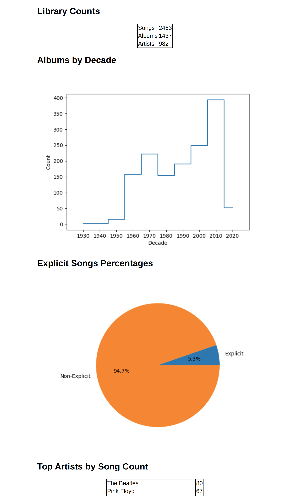

# Music Insights

## What Does This App Do
* **Downloads all your liked songs from Spotify** and related data and stores it in three files:
    * All the data is stored in human-readable **JSON** files, this serves as a **backup** and for loading the data later on.
    * Data stored for songs (songs.json): Time when it was liked, artists, duration, if it is explicit, ID, name, popularity, track number, if it is local, corresponding album ID and disk number.
    * Data stored for albums (albums.json): Artists, ID, name, release date, release date precision, songs and total tracks.
    * Data stored for artists (artists.json): Artist name and ID.
* **Creates a playlist for each decade with your liked songs** (I.E.: It groups liked songs by decades). This has the caveat that remastered albums will appear in recent years instead of the original release date.
* **Creates a mini HTML report** with the song, album and artist count, a graph with the albums by decades, a pie chart with the explicit percentage and your top 50 artists by song counts.

## Example Report



## How to Run

### Prerequisites

* You need a client_id, for that head over to [https://developer.spotify.com/dashboard/applications](https://developer.spotify.com/dashboard/applications) and create one app. Get the client id.
* Create src/spotify/credentials.py and add the following line: ```client_id = ...```.
* Add the following redirect URL to the APP settings: ```http://localhost/```.

### Running the App
```
cd $PROJECT_ROOT
python3.11 -m venv ./.venv
source .venv/bin/activate
pip install -r requirements.txt
python /src/main.py --download_and_save_library --create_playlists_by_decades --create_report
```

When downloading data and creating the playlists, the app will ask for authorization, follow the instructions in the terminal.
